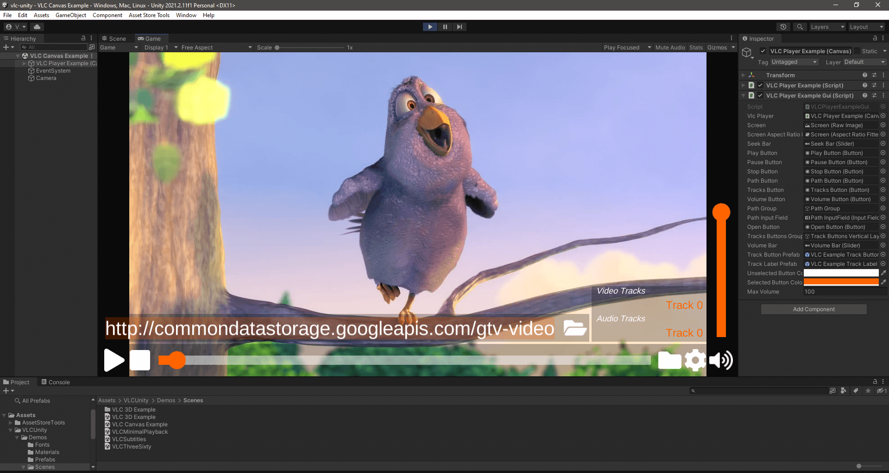

<h3 align="center">
    
</h3>

# VLC for Unity

This repository contains the native Unity plugin that bridges [LibVLCSharp](https://code.videolan.org/videolan/LibVLCSharp) with LibVLC for performance oriented video rendering in Unity3D applications and games. Available on the [Videolabs Store](https://videolabs.io/store).

- [VLC for Unity](#VLC-for-Unity)
  - [LibVLC Features](#libVLC-Features)
  - [Supported platforms](#supported-platforms)
  - [Installation](#installation)
  - [Getting started](#getting-started)
  - [Documentation](#documentation)
  - [Support](#support)
    - [StackOverflow](#stackoverflow)
  - [Sample scenes](#sample-scenes)
  - [Roadmap](#roadmap)
    - [Future platforms support](#future-platforms-support)
    - [Future graphics APIs](#future-graphics-APIs)
    - [Other improvements](#other-improvements)
  - [Release Notes](#release-Notes)
  - [Building](#building)
  - [Code of Conduct](#code-of-Conduct)
  - [Commercial Services](#commercial-services)
  - [License](#license)

## LibVLC Features

Given that this plugin is using [LibVLCSharp](https://code.videolan.org/videolan/LibVLCSharp) (which uses LibVLC), it exposes more or less the [same feature set](https://code.videolan.org/videolan/LibVLCSharp#features) and same codecs support than VLC, such as:

- Play every media file formats, every codec and every streaming protocols
- Run on every platform, from desktop (Windows, Linux, Mac) to mobile (Android, iOS) and TVs
- Hardware and efficient decoding on every platform, up to 8K
- Network browsing for distant filesystems (SMB, FTP, SFTP, NFS...) and servers (UPnP, DLNA)
- Playback of Audio CD, DVD and Bluray with menu navigation
- Support for HDR, including tonemapping for SDR streams
- Audio passthrough with SPDIF and HDMI, including for Audio HD codecs, like DD+, TrueHD or DTS-HD
- Support for video and audio filters
- Support for 360 video and 3D audio playback, including Ambisonics
- Able to cast and stream to distant renderers, like Chromecast and UPnP renderers.

And more.

## Supported platforms

- Windows Classic
  - Minimum OS version: Windows 7.
  - ABI supported: x64.
  - Graphics API: Direct3D 11
- Windows Modern (UWP)
  - Minimum OS version: Windows 10.
  - ABI supported: x64, ARM64.
  - Graphics API: Direct3D 11
- Android:
  - Minimum OS version: Android 5.0 Lollipop (API 21) for OpenGL ES.
  - For Vulkan support: Android 8.0 Oreo (API 26) or higher, ARM64 only.
  - ABIs supported: armeabi-v7a, arm64-v8a, x86, x86_64.
  - Graphics API: OpenGL ES 2/3, Vulkan
- iOS:
  - Minimum OS version: iOS 9.
  - ABI supported: ARM64. Simulator support will come later.
  - Graphics API: Metal
- macOS:
  - Minimum OS version: macOS 10.11.
  - ABI supported: Intel x64, Apple Silicon ARM64.
  - Graphics API: Metal

## Installation

The recommended way to install the VLC for Unity plugin is through the [Videolabs Store](https://videolabs.io/store/unity). This also ensures you get commercial support with your build.

| Platform          |  Videolabs Store Asset                          |
| ----------------- | ----------------------------------------------- |
| Windows           | [![VLCUnityBadge]][VideolabsUnityStore]         |
| UWP               | [![VLCUnityBadge]][VideolabsUnityStore]         |
| Android           | [![VLCUnityBadge]][VideolabsUnityStore]         |
| iOS               | [![VLCUnityBadge]][VideolabsUnityStore]         |
| macOS             | [![VLCUnityBadge]][VideolabsUnityStore]         |

[VideolabsUnityStore]: https://videolabs.io/store/unity

[VLCUnityBadge]: https://img.shields.io/badge/Made%20with-Unity-57b9d3.svg?style=flat&logo=unity

#### [Download the Free Trial Version](https://videolabs.io/#unity).

## Getting started

There is a quick `documentation.txt` file [included in the package](./Assets/VLCUnity/documentation.txt). It gives some context and high level overview of how things work and how to get started.

Since this Unity plugin largely shares the same API than LibVLCSharp, most LibVLCSharp [samples](https://code.videolan.org/mfkl/libvlcsharp-samples) and [documentation](https://code.videolan.org/videolan/LibVLCSharp/tree/3.x/docs) apply, do check those out!

## Documentation

See the [LibVLCSharp documentation](https://code.videolan.org/videolan/LibVLCSharp/tree/master/docs).

It includes [best practices](https://code.videolan.org/videolan/LibVLCSharp/blob/master/docs/best_practices.md), [Q&A guide](https://code.videolan.org/videolan/LibVLCSharp/blob/master/docs/how_do_I_do_X.md), [libvlc specific information](https://code.videolan.org/videolan/LibVLCSharp/blob/master/docs/libvlc_documentation.md) and [tutorials](https://code.videolan.org/videolan/LibVLCSharp/blob/master/docs/tutorials.md).

## Support

If you encounter a problem with VLC for Unity, please [open an issue](https://code.videolan.org/videolan/vlc-unity/-/issues) using the **issue template**. The template provides a structure that you can fill in to give us all the necessary information for us to troubleshoot your issue.

Support is done on a volunteer base, professional support is only available for [paying customers](https://videolabs.io/store).

### StackOverflow

We regularly monitor the  and  tags on StackOverflow.

## Sample scenes

Several Unity [sample scenes](./Assets/VLCUnity/Demos/Scenes) are available to help you get started quickly!

- A minimal playback example with buttons,
- 360 playback with keyboard navigation built-in,
- A video with subtitles showcasing support,
- The VLCPlayerExample provides a great base with more controls,
- 3D scene you can move around in with a movie screen and chairs in a cinema room.

 

More LibVLCSharp samples can be found [here](https://code.videolan.org/mfkl/libvlcsharp-samples).

## Roadmap

### Future platforms support

- tvOS,
- Browser,
- Linux.

### Future graphics APIs

- Vulkan (on other targets than Android)
- WebGL

### Other improvements

- Provide in-Editor MediaPlayer customization, so you can customize LibVLC and playback parameters directly from the Unity Editor.

## Release Notes

Check out the [NEWS](NEWS) file for details about each release.

## Debugging

Editor crash location: `C:\Users\YourUserName\AppData\Local\Temp\Unity\Editor\Crashes`

## Code of Conduct

Please read and follow the [VideoLAN CoC](https://wiki.videolan.org/Code_of_Conduct/).

## Commercial services

The VLC for Unity integration makes use of several software components to provide a full featured and easy to use VLC player in your Unity apps and games. It goes without saying that this represents significant work. This work is handled by both the OSS community and opensource consulting partners. The frontiers and rules of commercial and open-source cohabitation can sometimes be blurry and confusing. The following information aims to clarify that.

### Distribution

Distribution can be defined as _the way in which you acquire a piece of software_, in this case, a VLC for Unity asset.

| Distribution                        | $$$ Cost                               |
| ----------------------------------- | ---------------------------------------|
| Build from source                   | Free                                   |
| Download from the Videolabs Store   | 700$ per year (all platforms included) |

The whole of the VLC for Unity asset is open-source. Which means that you can definitely build it yourself and use it, for free.
Depending on your experience building native and managed code, it can be a challenging (yet rewarding) endeavor.

For convenience, [Videolabs](https://videolabs.io/) provides the already built binaries through the Videolabs Store. Building, maintaining and publishing these assets properly takes time and skill, this is the reason for the financial cost.

### Support

VLC for Unity combines wide and powerful bricks of software. Bugs happen and feature requests, too. That is an expected part of software development. If you encounter an issue on VLC for Unity, depending on which component is at play, you have a few options to choose from at your disposal:

| Support                                   | $$$ Cost                 |
| ----------------------------------------- | -------------------------|
| Debug and fix the code by yourself        | Free                     |
| Limited support                           | Free                     |
| Bug in the Unity integration              | Free (+ paid if urgent)  |
| Feature request for the Unity integration | Paid                     |
| Bug in VLC                                | Paid                     |
| Feature request for VLC                   | Paid                     |
| Performance optimization for VLC or Unity | Paid                     |

If you encounter a problem with VLC for Unity, please [open an issue](https://code.videolan.org/videolan/vlc-unity/-/issues) using the **issue template**. The template provides a structure that you can fill in to give us all the necessary information for us to troubleshoot your issue.

**Important note**

VLC is a large ecosystem run by the VideoLAN non-profit and a community of volunteers.
[Videolabs](https://videolabs.io/) is an independent company providing development services around VLC open source technologies.
While [Videolabs](https://videolabs.io/) does ship and sell the Unity integration, Videolabs declines all responsibility for issues specific to VLC.

However, Videolabs being the main contributors to VLC improvements, feel free to reach out in case of related commercial projects.

### More services

If you would like VLC developers to provide you with:

- custom development on LibVLC, VLC for Unity and/or LibVLCSharp, 
- training and workshops,
- support services,
- consulting services,
- other multimedia services.

Feel free to [contact us](https://videolabs.io/#contact).

## License

Licensed under the LGPL 2.1 and proprietary license via [Videolabs](https://videolabs.io/).

 

    

